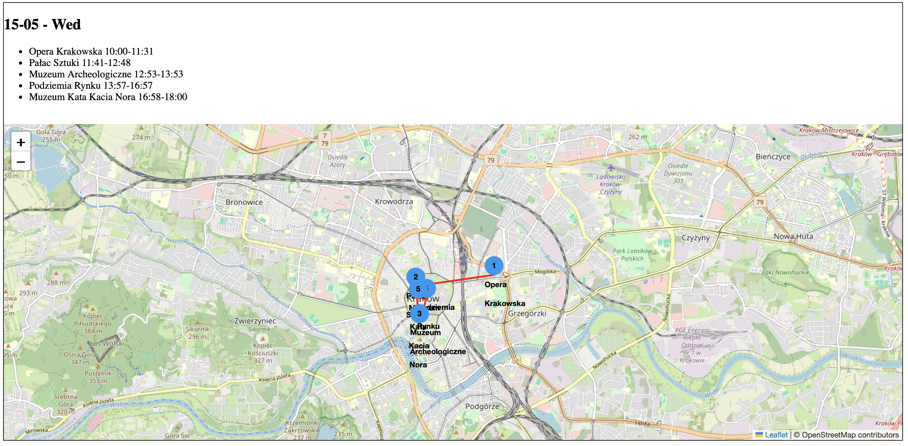

# Virtual Tourist Office System

This application was created as part of my master's thesis. Its purpose is to generate a personalized travel plan for the city of Kraków in Poland. The selection of points of interest is based on the textual description of travel desires provided by the tourist.

General overview of the algorithm:


Screenshots from the application:




## Running the project

Starting the system requires an installed Docker platform (https://www.docker.com/) and 
your own OpenAI API account (https://openai.com/index/openai-api) along with a key.

In addition to the application code, the repository contains the following files:
- .env - configuration file
- embeddings.json
- pois.json
- categories.json
- docker-compose.yaml

In the `.env` file, you need to fill in the following variables:
- for the `OPENAI_API_KEY` variable, provide your OpenAI API key
- for the `EMBEDDINGS_LOADER_SOURCE_FILE_PATH` variable, provide the absolute path to the `embeddings.json` file
- for the `POIS_FILE_PATH` variable, provide the absolute path to the `pois.json` file
- for the `CATEGORIES_FILE_PATH` variable, provide the absolute path to the `categories.json` file

After filling in the `.env` file, run the following command inside the repository:

```commandline
docker compose -f docker-compose.yaml up
```

Two containers, mongo_loader and embeddings_loader, will be in the Exited state after a few seconds. This is normal
and desired behavior. When the flask_app container starts, enter the address 0.0.0.0:5000 in your browser. The first
query execution in the application takes a bit more time. Each subsequent one is faster.
